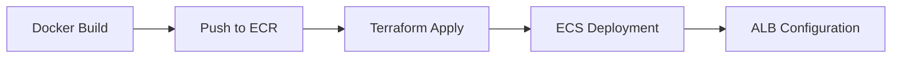
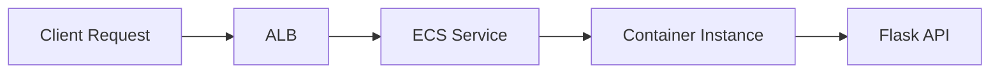

# Hello World API System Architecture Overview

Note: I tested this ona macbook and do not have a windows machine to test powershell commands on. 

## System Components & Structure

### 1. API Application (`api/`)
- A Flask-based Python API that serves:
  - `/` endpoint returning "Hello World" with environment info
  - `/health` endpoint for health checks
- Uses Gunicorn as the WSGI server for production-grade serving
- Configurable through environment variables

### 2. Docker Configuration (`docker/`)
```dockerfile:docker/Dockerfile
# Key features:
- Uses Python 3.9 slim base image
- Configures working directory and dependencies
- Runs multiple Gunicorn workers (4) for concurrent requests
- Exposes port 5000
```

The `docker-compose.yml` provides:
- Local development environment
- Health check configuration
- Environment variable mapping
- Port mapping (5000:5000)

### 3. Infrastructure as Code (`infrastructure/terraform/`)

#### Main Infrastructure (`main.tf`)
1. **Networking Layer**
   - VPC with public subnets
   - Distributed across multiple availability zones

2. **Load Balancing**
   - Application Load Balancer (ALB)
   - Handles traffic distribution
   - Public-facing entry point

3. **Container Orchestration**
   - ECS Cluster using Fargate
   - Task definitions for the API container
   - Auto-scaling capabilities
   - Network security groups

#### Variables (`variables.tf`)
Configurable parameters including:
- AWS region
- Project name
- Environment
- Availability zones
- Service scaling
- Container registry URL

#### Outputs (`outputs.tf`)
Exposes important infrastructure information:
- Load balancer DNS and zone ID
- VPC and subnet IDs
- ECS cluster details
- Security group IDs
- API endpoint URL

## How It Works

### 1. Deployment Flow


### 2. Request Flow


### 3. Scaling Mechanisms
- **Horizontal Scaling**: ECS service can scale task count
- **Load Distribution**: ALB handles request distribution
- **Resource Optimization**: Fargate manages container resources

## Deployment Options

### 1. AWS Cloud Deployment
```bash
# 1. Build and push Docker image
docker build -t hello-world-api .
docker push $ECR_REGISTRY/hello-world-api

# 2. Deploy infrastructure
cd infrastructure/terraform
terraform init && terraform apply
```

### 2. On-Premise Deployment
- Can use the same Docker image
- Replace AWS services with equivalents:
  - ALB → NGINX/HAProxy
  - ECS → Kubernetes/Docker Swarm
  - Auto-scaling → K8s HPA

## Key Features

1. **High Availability**
   - Multi-AZ deployment
   - Load balancer health checks
   - Container redundancy

2. **Scalability**
   - Auto-scaling capabilities
   - Containerized architecture
   - Distributed load balancing

3. **Maintainability**
   - Infrastructure as Code
   - Containerized application
   - Environment configuration
   - Health monitoring

4. **Security**
   - Network isolation
   - Security groups
   - Private subnets (can be added)


